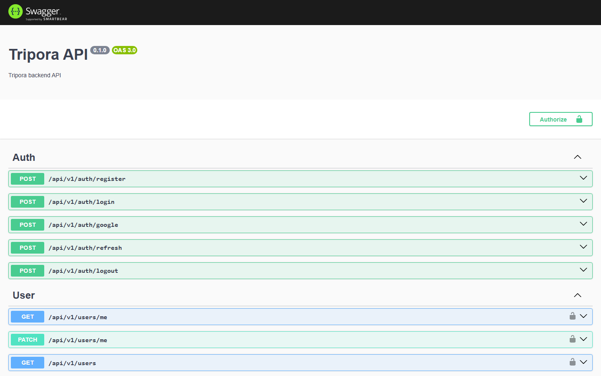

# Tripora — Backend API

REST API powering **Tripora**, a full-stack travel marketplace: hotel, tour, experience, transport and flight booking, Stripe payments, a multi-tenant provider marketplace with RBAC, and a real-time social layer — built incrementally across 9 shipped phases (V1 → V9).

Part of a 3-repo system: this API, a [customer-facing Next.js app](https://github.com/nguyendotai/Tripora-site), and an [admin/provider dashboard](https://github.com/nguyendotai/Tripora-admin).

**🔗 Live API:** [tripora-backend-1932.onrender.com](https://tripora-backend-1932.onrender.com) · **Swagger docs:** [/docs](https://tripora-backend-1932.onrender.com/docs)
> Hosted on a free instance — the first request after a period of inactivity can take 30–60s to wake up.



## Highlights

- **49 domain modules, 250+ REST endpoints** — Auth, 5 independent booking domains (Hotel/Tour/Experience/Transport/Flight), Payment, Coupon/Promotion, Refund, Commission, Provider Marketplace, Social (Posts/Follow/Comment), Realtime, Analytics.
- **Multi-tenant Provider Marketplace with RBAC** — `OrganizationMember` roles (Owner / Manager / Booking Staff / Finance Staff), a static permission matrix enforced per-endpoint, no data leaks across tenants.
- **Real payment processing** — Stripe Checkout + webhooks (signature-verified), tiered cancellation refunds, coupon/promotion discounting, per-provider commission accounting.
- **Anti-overselling by design** — every booking path decrements inventory atomically inside a DB transaction (`UPDATE ... WHERE available >= qty`, checked via affected-row count) instead of read-then-write, including a seat-level allocation strategy for flights.
- **Realtime + background processing** — Socket.IO push notifications and chat, Redis-backed caching/rate-limiting, BullMQ queues for notifications, booking expiration, and async report generation.
- **Auth** — JWT access/refresh tokens, Google Sign-In (ID token verification), role-based guards.

## Tech Stack

| Layer | Choice |
| :--- | :--- |
| Framework | [NestJS](https://nestjs.com/) (TypeScript) |
| Database | MySQL (InnoDB) via [Prisma ORM](https://www.prisma.io/) |
| Auth | JWT (access + refresh), Passport, Google OAuth ID token verification |
| Payments | [Stripe](https://stripe.com/) (Checkout Sessions + webhooks) |
| Realtime | Socket.IO |
| Cache / Queues | Redis, [BullMQ](https://docs.bullmq.io/) |
| Media | Cloudinary |
| Validation | class-validator / class-transformer |
| API Docs | Swagger / OpenAPI |

## Architecture Notes

A few decisions worth calling out to anyone reading the code:

- **Single source of truth for business logic.** Both frontend apps only call this API — pricing, discounting, inventory, and refund calculations never happen client-side.
- **5 separate booking tables, one shared `BookingStatus` enum**, instead of a single polymorphic table — each domain (hotel nights, tour/experience seats-per-day, transport seats, flight seats) has a genuinely different inventory shape, so keeping them distinct kept every query simple and type-safe rather than forcing a lowest-common-denominator schema.
- **`Provider.type` drives dispatch everywhere a feature spans domains** (commissions, occupancy analytics, "my reviews") — since one provider only ever sells one product type, a `switch` on that single enum replaces what would otherwise be 5x duplicated logic.
- **Payments reference bookings polymorphically** (`bookingDomain` + `bookingId`, not a Prisma relation) specifically to avoid `PaymentModule` importing all 5 booking modules and creating a circular dependency graph.
- **Additive-only schema evolution.** New product types (e.g. extending Reviews from Hotel-only to Tour/Experience/Flight) are shipped as new nullable FK columns + unique constraints, never breaking changes to existing ones.

## Getting Started

```bash
npm install
cp .env.example .env   # fill in DATABASE_URL, JWT secrets, and (optionally) Stripe/Cloudinary/Google keys
npm run prisma:generate
npm run prisma:migrate   # requires a running MySQL instance matching DATABASE_URL
npm run start:dev
```

The API runs at `http://localhost:5550/api/v1`, with interactive Swagger docs at `http://localhost:5550/docs`.

> Redis is required to boot (caching, rate limiting, BullMQ) — see `.env.example` for `REDIS_URL`. Stripe/Cloudinary/Google credentials are only needed to exercise those specific flows; the app runs without them for everything else.

## Project Structure

```
src/
  modules/     # one module per domain (auth, property, tour-booking, payment, review, ...)
  common/      # shared decorators/guards (roles, current-user, ...)
  database/    # PrismaService / DatabaseModule
  redis/       # cache + BullMQ queue wiring
  shared/      # cross-cutting utils (pagination, slugify, id parsing, ...)
prisma/
  schema.prisma
  migrations/
```

## Scripts

| Command | Description |
| :--- | :--- |
| `npm run start:dev` | Start in watch mode |
| `npm run build` | Production build |
| `npm run lint` | Lint + auto-fix |
| `npm run test` | Unit tests |
| `npm run prisma:migrate` | Create/apply a dev migration |
| `npm run prisma:studio` | Open Prisma Studio |
